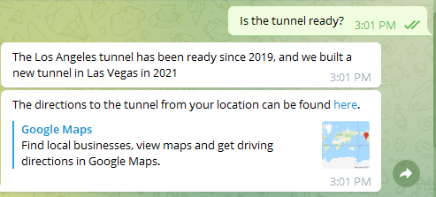
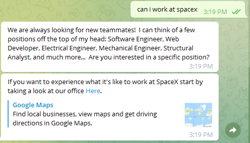

# Elon Musk Bot   

<p align="center"> 

</p>

Elon Musk Bot is a chatbot inspired by the entrepreneur and billionaire Elon Musk. It can answer questions about Tesla, SpaceX, cryptocurrencies, and more - give it a try!

## Code Structure

```
    .
    ├── elonmusk                        # Code for the Python back-end
    │   ├── main.py                     # Entrypoint for Cloud Function
    │   ├── intent_handlers.py          # Logic for each Intent (i.e. Topic) Elon can talk about
    ├── tests                           # Tests for the bot
    │   ├── data                        # Raw data from Dialogflow after Intent and Entity matching
    │   ├── mock_dialogflow_utils.py    # Utilities for writing tests
    │   ├── test_billionaire_tax.py     # Elon can talk about his tax contributions
    │   ├── test_crypto_advice.py       # Elon can offer crypto advice
    │   ├── test_dailyroutine.py        # Elon can offer insights into his daily routine
    │   ├── test_fight_putin.py         # Elon can talk about his current opinion on Russia and Putin's actions
    │   ├── test_neuralink_app.py       # Elon can elaborate on some applications of the Link
    │   ├── test_spacex_work.py         # Elon can talk about job opportunities at SpaceX
    │   ├── test_stand_with_ukraine.py  # Elon can offer his opinion on the current situation in Ukraine 
    │   ├── test_what_company.py        # Elon can answer about his companies
    │   ├── test_what_is_crypto.py      # Elon can answer questions related to crypto
    └── README.md                       # This file!
```

## APIs implemented as Individual Project

1. ### Google Directions API

    The Bot is now able to provide you the directions from your current location to the nearest opening for the Hyperloop tunnel, This improves the overall experience by allowing the user the possibility to go experience the tunnel without having to search for it themselves as it is not taht easily found on google maps. The implementation uses a url call to the API the result of which is made available as a clickable link to the user on telegram. The parameter specified is the location of the tunnel, the user is able to see the directions from their current location or update the starting location as needed.

<p align="center"> 

</p>

2. ### Google Street View Image API

    The bot is now able to provide the user with the street view experience of the SpaceX facility when the user shows interest in working there. This enriches the user expereince by not only providing an insight into the workplace but also giving a starting point for further research by showing where and nhow the building looks. The implementation uses a url call to the API the result of which is made available as a clickable link to the user on telegram. The parameter provided is the starting locaton. Once inside the streetview, the user is able to move around freely.

<p align="center"> 

</p>

Both these APIs work regardless of whether the bot is being used on the telegram mobile app or the telegram PC app.

## Built With

* [Python](https://www.python.org/) - Back End
* [Dialogflow](https://cloud.google.com/dialogflow/docs) - Natural Language Processing
* [Telegram](https://telegram.org/) - User Interface
* [Google API](https://developers.google.com/maps/get-started) - Street View and Directions

## Author (Individual Project) Based on the work done by Group 32

* [Akshat Singal](https://github.com/aksingal-dev)